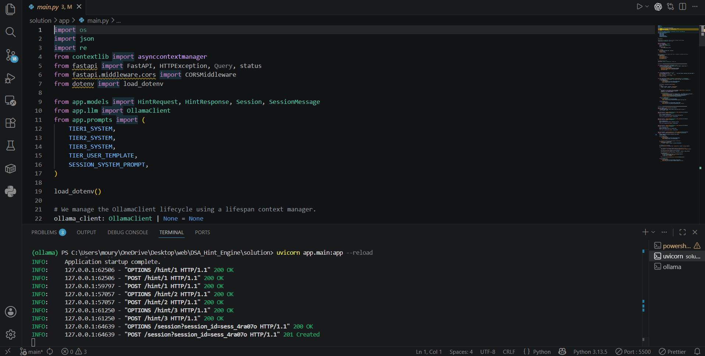
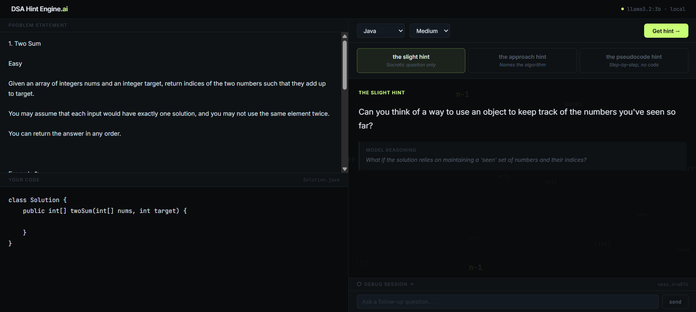
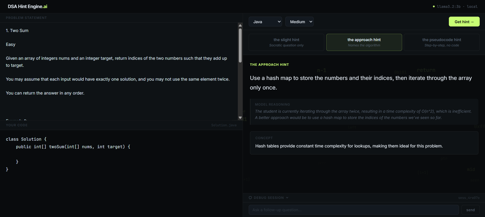
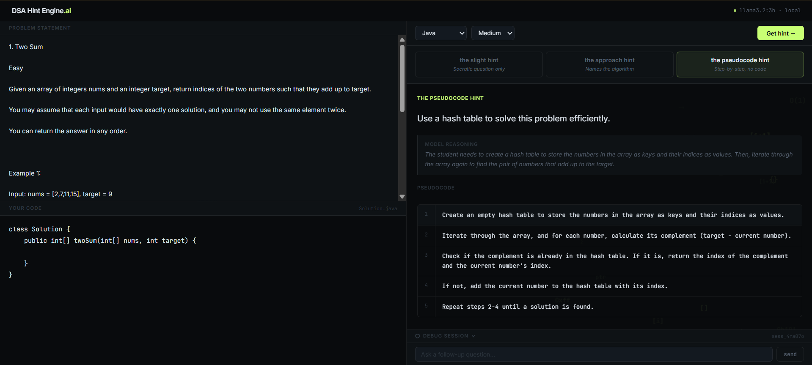

# DSA Hint Engine
---


## Architectural Blueprint

The **DSA Hint Engine** addresses a classic education failure: showing students the solution kills the learning process, while vague hints offer zero help. 

By leveraging local LLM inference, prompt chaining, and stateful session memory, this API delivers progressive hints tailored to the student's unique bottleneck:

```
                  ┌───────────────────────────────┐
                  │      Student Frontend / UI    │
                  └───────────────┬───────────────┘
                                  │ POST /hint/1, /hint/2, /hint/3
                                  ▼
┌───────────────────────────────────────────────────────────────────┐
│                     FastAPI Web Server (Async)                    │
│                                                                   │
│  1. Request Validation (Pydantic schemas)                         │
│  2. Lifespan Manager (HTTPX Async Client pools)                   │
│  3. Tier Router (path-based: /hint/1, /hint/2, /hint/3)          │
│  4. Session Router (/session endpoint)                            │
│  5. In-Memory Session Memory (Stateful dictionary store)          │
│                                                                   │
│        ┌───────────────┐                  ┌───────────────┐       │
│        │  Prompt Tier  │                  │ System Prompt │       │
│        │   Selection   │                  │  Guardrails   │       │
│        └───────┬───────┘                  └───────┬───────┘       │
└────────────────┼──────────────────────────────────┼───────────────┘
                 │                                  │
                 └────────────────┬─────────────────┘
                                  │ Local HTTP JSON Call
                                  ▼
┌───────────────────────────────────────────────────────────────────┐
│                      Ollama Local Daemon (11434)                  │
│                                                                   │
│   Model: llama3.2:3b                                              │
│   Parameter Constraint: format="json"                             │
│   Inference Engine: Runs fully offline (0 token costs!)           │
└───────────────────────────────────────────────────────────────────┘
```

---

## Workspace Architecture

This repository contains a full set of materials for a 3-hour live workshop:

```text
dsahintengine/
│
├── solution/                # Complete Reference Implementation
│   ├── app/                 # Fully operational FastAPI endpoints + Ollama integration
│   ├── examples.md          # 3 Hand-tested LeetCode problems (Two Sum, Parentheses, Linked Lists)
│   ├── .env.example         # Solution-ready configuration template
│   └── requirements.txt     # Reference dependencies
│
├── setup_checklist.md       # Environment preparation checklist and troubleshooting matrix
└── student_notes.md         # Quick reference cheat sheet detailing the 5 core builder concepts
```

---

## Core Concepts

1. **Local LLM Inference**: Invoking locally running open-weight models (`llama3.2:3b`) directly via HTTP protocols using standard `httpx` async calls. This cuts API dependencies, removes billing boundaries, and keeps code data 100% private.
2. **Progressive Prompt Chaining**: Avoiding massive "all-in-one" prompt failures by routing inputs across specific hierarchical templates via separate endpoints (`/hint/1` conceptual, `/hint/2` algorithmic, `/hint/3` pseudocode).
3. **Structured System Guardrails (JSON Mode)**: Forcing model compliance with Pydantic output schemas via system prompt boundaries and Ollama's native JSON format parameter to guarantee parsing reliability.
4. **Stateful In-Memory Session Stores**: Designing an in-memory session database mapping unique UUIDs to multi-turn conversation arrays, passing full history lists to the LLM to model natural debugging chat.
5. **Lifespan-Managed API Deployments**: Utilizing async FastAPI application contexts to efficiently manage persistent HTTPX client connection pools and serving with high-speed Uvicorn workers.

---

## Quick-Start Guide

Run the reference implementation locally in minutes. Ensure you have **Python 3.10+** and **Ollama** installed on your system.

### 1. Download & Launch the Model
Open your Ollama Desktop Application, or run the background daemon:
```bash
# Verify the daemon is running and retrieve the 3B model
ollama pull llama3.2:3b
```

### 2. Set Up Your Python Environment
Navigate to either the `starter` or `solution` directory, set up your virtual environment, and install dependencies:
```bash
cd solution

# Create a virtual environment
python3 -m venv venv

# Activate it (Mac/Linux)
source venv/bin/activate

# Install requirements
pip install -r requirements.txt

#run the script
.\start-project.ps1
```

### 3. Initialize Environment Variables
Create a local `.env` file from the starter template:
```bash
cp .env.example .env
```

The default values are configured to talk directly to your local instance:
```env
OLLAMA_HOST=http://localhost:11434
MODEL_NAME=llama3.2:3b
```

### 4. Boot Up the API Server
Launch the application server with hot-reloading enabled:
```bash
uvicorn app.main:app --reload
```
The server will start running on **`http://127.0.0.1:8000`**. You can verify that it is alive by navigating to `http://127.0.0.1:8000/docs` to view the interactive Swagger API documentation.


---

## API Documentation & Interactive Endpoints

### 1. Simple Health Check
Verifies that the server and routing mechanisms are active.
* **Method**: `GET`
* **Route**: `/health`
* **Response Status**: `200 OK`
* **Response Body**:
  ```json
  {
    "status": "ok"
  }
  ```

---

### 2. Tier 1 — Slight Conceptual Hint



Asks one Socratic guiding question. Never names the algorithm or data structure.
* **Method**: `POST`
* **Route**: `/hint/1`
* **Request Header**: `Content-Type: application/json`
* **Request Schema (`HintRequest`)**:
  ```json
  {
    "code": "def twoSum(nums, target):\n    for i in range(len(nums)):\n        for j in range(i + 1, len(nums)):\n            if nums[i] + nums[j] == target:\n                return [i, j]",
    "problem_description": "Given an array of integers nums and an integer target, return indices of the two numbers such that they add up to target.",
    "programming_language": "python",
    "difficulty": "Easy"
  }
  ```
* **Response Schema (`HintResponse`)**:
  ```json
  {
    "thought_process": "Student uses O(n^2) nested loops. Need to guide toward O(1) lookup.",
    "hint": "You're scanning the list repeatedly. Is there a way to check if a complement exists in one step?",
    "conceptual_explanation": null,
    "pseudocode_steps": null
  }
  ```

---

### 3. Tier 2 — Approach Hint



Names the algorithm, explains why the current approach is slow.
* **Method**: `POST`
* **Route**: `/hint/2`
* **Request Schema**: Same `HintRequest` as above.
* **Response Schema (`HintResponse`)**:
  ```json
  {
    "thought_process": "Brute-force O(n^2). Hash map gives O(n) with O(n) space.",
    "hint": "Use a hash map. Store each number's index as you iterate, then check if the complement exists.",
    "conceptual_explanation": "A hash map provides O(1) average lookup. Storing seen values lets you find pairs in one pass.",
    "pseudocode_steps": null
  }
  ```

---

### 4. Tier 3 — Pseudocode Hint



Numbered plain-English pseudocode steps. No runnable code.
* **Method**: `POST`
* **Route**: `/hint/3`
* **Request Schema**: Same `HintRequest` as above.
* **Response Schema (`HintResponse`)**:
  ```json
  {
    "thought_process": "Student needs step-by-step implementation guide.",
    "hint": "Initialize a lookup dictionary, then iterate and check complements.",
    "conceptual_explanation": null,
    "pseudocode_steps": [
      "1. Create an empty dictionary called seen.",
      "2. Loop through each number and its index.",
      "3. Calculate complement = target minus current number.",
      "4. If complement exists in seen, return both indices.",
      "5. Otherwise, store current number and index in seen."
    ]
  }
  ```

---

### 5. Stateful Debugging Session


Enables an interactive back-and-forth debugging conversation using an in-memory session history database.
* **Method**: `POST`
* **Route**: `/session`
* **Query Parameters**:
  * `session_id` (string, required): A unique session key identifying this specific conversation stream (e.g., `sess_12984a`).
* **Request Header**: `Content-Type: application/json`
* **Request Schema (`SessionMessage`)**:
  ```json
  {
    "role": "user",
    "content": "Wait, how does storing values in a dictionary help me find the complement in O(1) time?"
  }
  ```
* **Response Schema (`Session`)**:
  ```json
  {
    "session_id": "sess_12984a",
    "history": [
      {
        "role": "user",
        "content": "Wait, how does storing values in a dictionary help me find the complement in O(1) time?"
      },
      {
        "role": "assistant",
        "content": "A dictionary is a hash map under the hood. In Python, searching `if complement in seen` takes constant O(1) time on average. When you store each number's index as `seen[num] = index`, you can immediately check if your current number's partner was already encountered."
      }
    ]
  }
  ```

## Verified LeetCode Examples

We have hand-tested and verified three core algorithmic cases to demonstrate how the hint engine scales across difficulty tiers. Details of these interactions are archived in `solution/examples.md`:

1. **Two Sum**: Moving from brute-force O(N^2) loops to linear O(N) hash map storage.
2. **Valid Parentheses**: Recognizing ordering failures from simple character counts and adopting stack operations (LIFO).
3. **Reverse Linked List**: Caching forward pointer bounds during dynamic variable reassignments to prevent infinite loops.

---

## Common Troubleshooting

| Issue | Root Cause | Solution |
| :--- | :--- | :--- |
| **`Connection Refused` on port 11434** | Ollama local background service is inactive. | Start the Ollama Desktop app or run `ollama serve` in a background terminal. |
| **`HTTP 404 (Model Not Found)`** | The `llama3.2:3b` model is missing from your system. | Run `ollama pull llama3.2:3b` inside your console. |
| **`Address already in use` on port 8000** | Port 8000 is occupied by another local server process. | Kill the process using `kill -9 $(lsof -t -i:8000)` or change port using `--port 8080`. |
| **`SyntaxError` on union types (`\|`)** | The system Python environment version is older than 3.10. | Ensure Python 3.10+ is active. If needed, recreate environment using `python3.10 -m venv venv`. |
| **High request response latency** | Computer running low on memory. | Ensure at least 4 GB of RAM is free. Close high-memory active applications (e.g. Docker, IDEs). |

---
